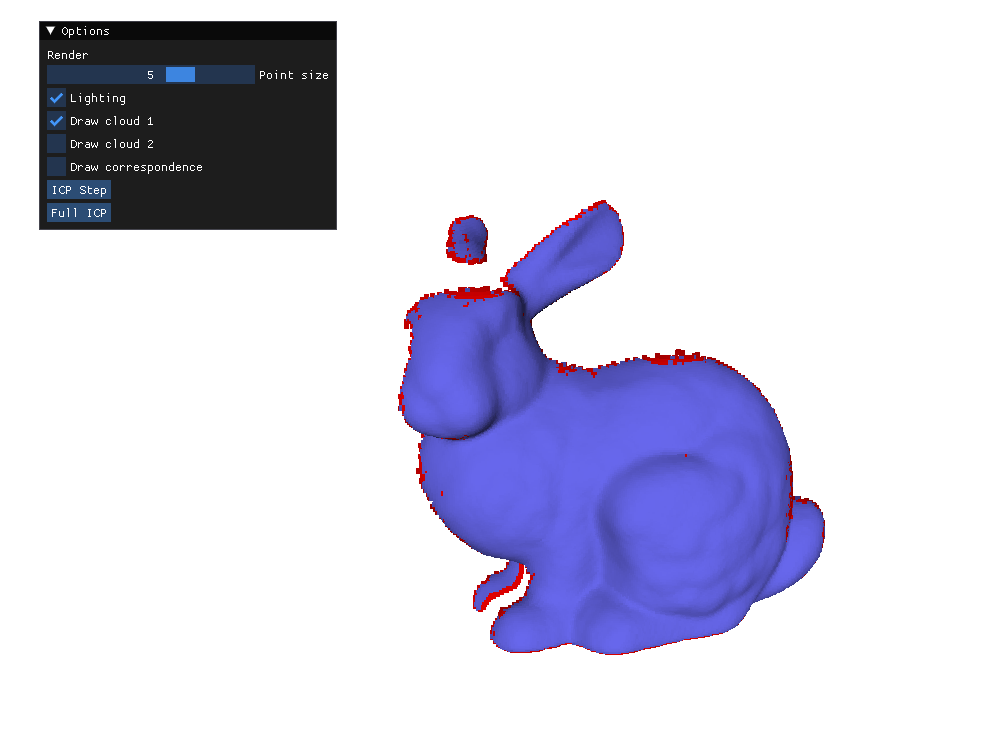
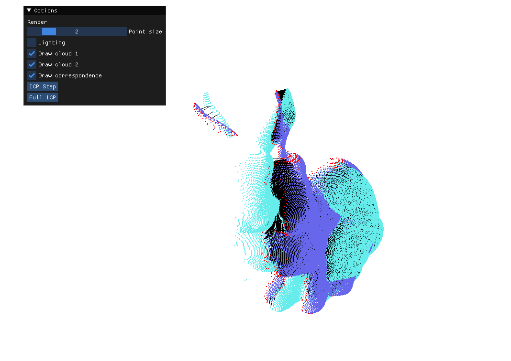
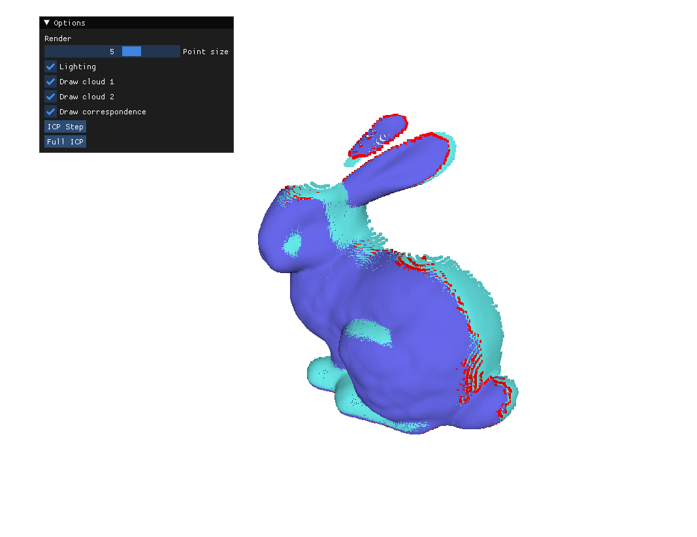
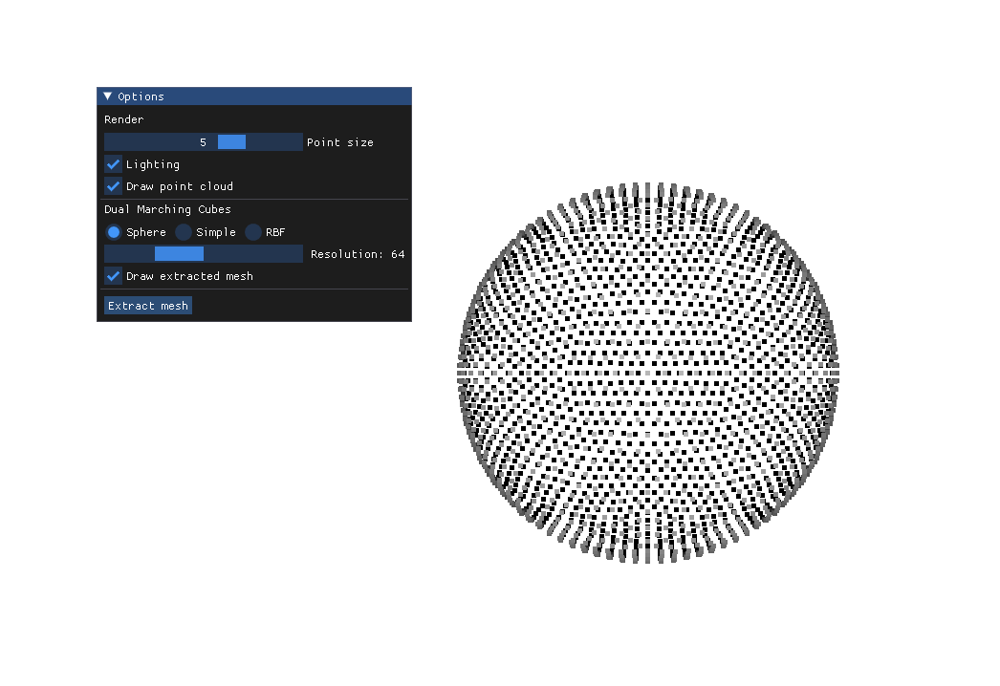
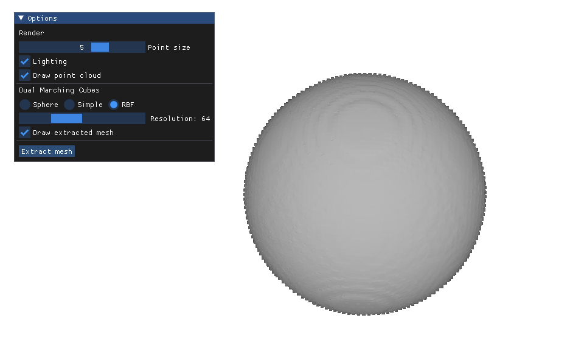
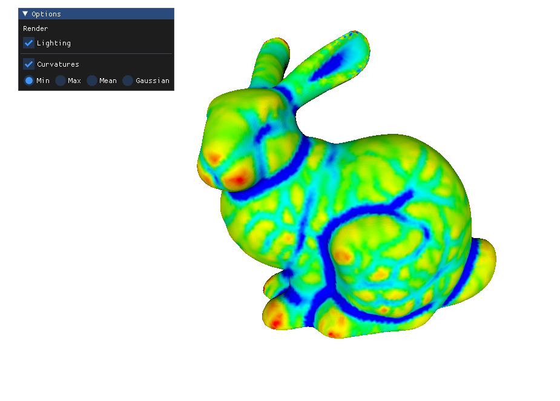
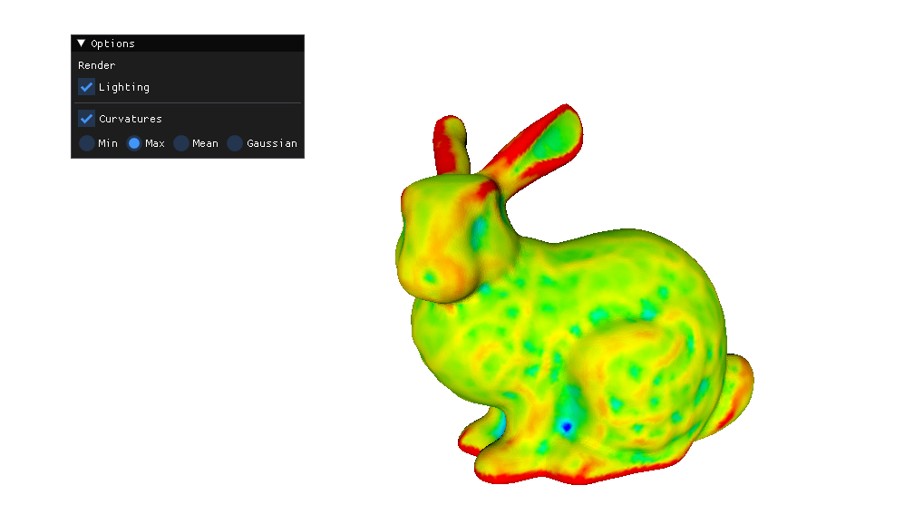
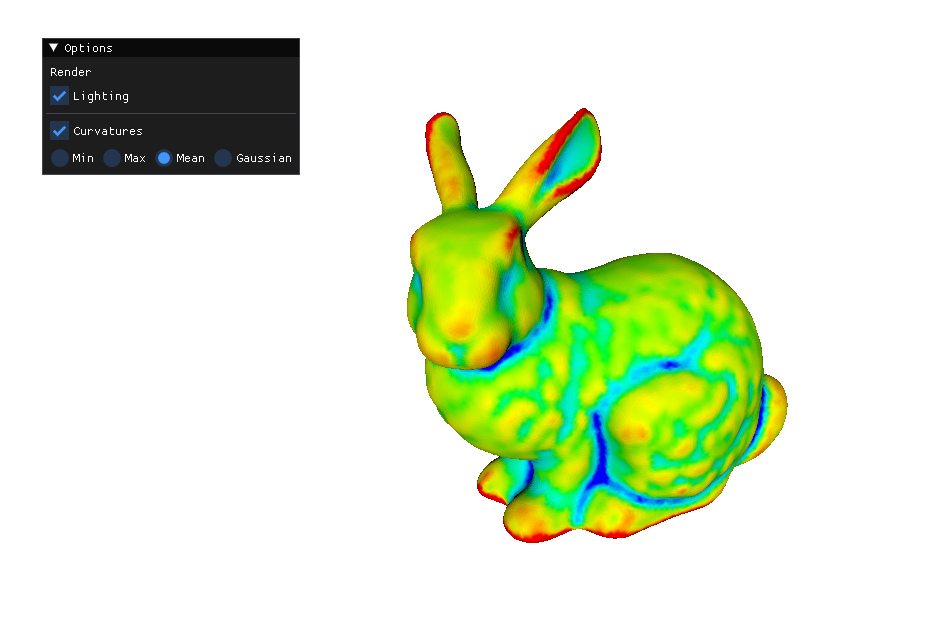
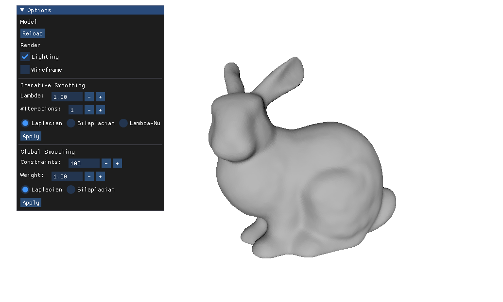
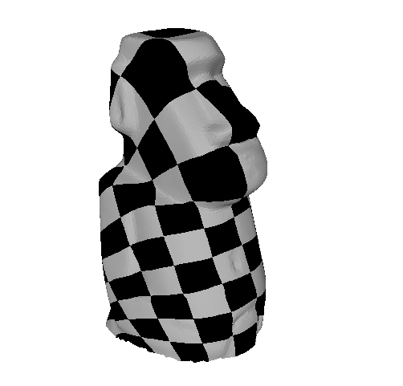

# Graphic Processing Labs

## Overview

This repository contains a series of graphic processing labs, each focusing on different aspects of computer graphics. Explore the implementation of various techniques and concepts in these labs.

## Labs

### Lab 1 & 2: Normal Vector Calculation and ICP

- **Description:** This lab implements the calculation of normal vectors for each point cloud and the Iterative Closest Point (ICP) algorithm for point cloud registration.

- **Images:**
  - 
  - 
  - 

### Lab 3: Surface Reconstruction using RBF

- **Description:** Implement surface reconstruction using Radial Basis Function (RBF). Explore the process of reconstructing surfaces from point clouds.

- **Image:**
  - 
  - 

### Lab 4: Curvature Estimation with Monge Patch

- **Description:** This lab focuses on curvature estimation using Monge patch. Understand and implement techniques for estimating curvature on surfaces.

- **Image:**
  - 
  - 
  - 
  - 

### Lab 5: Iterative LSSP (Least Squares Smoothing)

- **Description:** Smooth images using Iterative Least Squares Smoothing. Explore iterative techniques for achieving image smoothing.

- **Image:**
  - 

### Lab 6: Parametrization of Texture

- **Description:** Implement texture parametrization techniques. Understand how to map textures onto surfaces in a parametric manner.

- **Image:**
  - 
